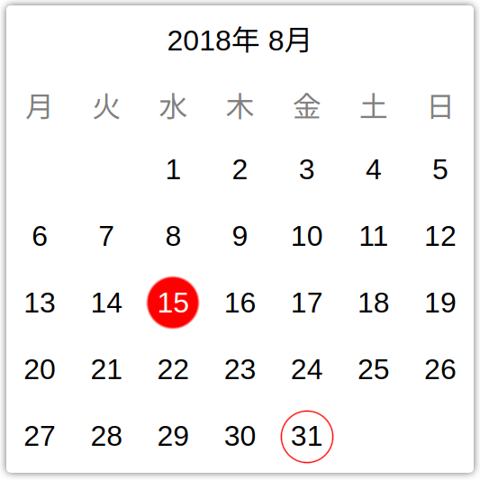
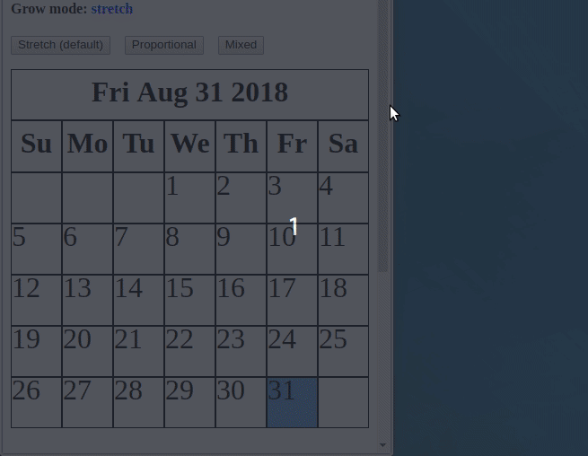
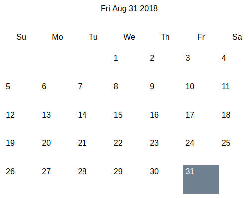
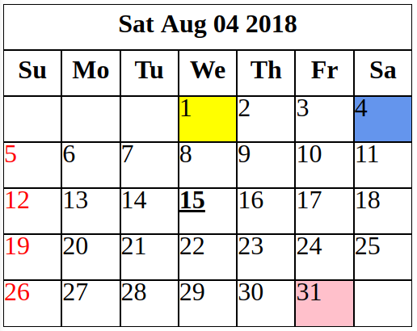

# SimpleCalendar

Angular component that represents a calendar, responsive, fast and easy to use. Here's the minimum code needed to instantiate it:

```html
<div class="wrapper">
  <sc-month-calendar></sc-month-calendar>
</div>
```

That code produces this result:


But after customized, it can produce results like this one:



The next sections explain the different concepts around the calendar.

## Wrapper
The wrapper is an element the calendar needs in order to limit its size. The calendar, in any of its three configurations, tends to ocuppy the maximum area of the container that holds it. If no wrapper is provided, the calendar will expand until ocuppy the entire area.

Normally the wrapper will be a `div` with one of these classes:

```css
/*
  Limited in width,
  useful with grow mode proportional
  or grow mode mixed
*/
.wrapper-horizontally-limited {
  width: 500px;
}

/*
  Limited in height,
  useful with grow mode stretch
*/
.wrapper-vertically-limited {
  width: 100%;
  height: 500px;
}
```
As it can be read from the comments, the choice of the wrapper depends on the grow mode that will be used.

## Grow modes
There are three different grow modes:

* **`stretch`**: (Default) Adapts vertically and horizontally to the wrapper.
* **`proportional`**: Adapts horizontally to the wrapper, keeping a 1:1 aspect ratio in all its cells.
* **`mixed`**: Behaves like `stretch` for the month caption and day of week captions, and behaves like `proportional` for the day captions.



The grow mode can be configured with a code like this one:

```html
<div class="wrapper">
  <sc-month-calendar [grow]="{ mode: 'proportional' }">
  </sc-month-calendar>
</div>
```

## Formatters
Formatters are essentially functions that accept some value as input and produce a formatted string as output. The calendar uses them for both, internationalization (i18n) and formatting.

There are three configurable formatters:

### Month caption formatter
It's the formatter responsible for formatting the month caption. It can be used as follows:

```typescript
monthCaptionFormatter = (date: Date) => {
  return `${date.getFullYear()}年 ${date.getMonth() + 1}月`;
}
```

And in the HTML code:

```html
<div class="wrapper">
  <sc-month-calendar [monthCaptionFormatter]="monthCaptionFormatter">
  </sc-month-calendar>
</div>
```

### Day of week caption formatter
The responsability of this formatter is to format the captions of the different days of the week. It can be used in this way:

```typescript
private daysOfWeekInJapanese = [
  '月', '火', '水', '木', '金', '土', '日'
];

dayOfWeekCaptionFormatter = (dayOfWeek: DayOfWeek) => {
  return this.daysOfWeekInJapanese[dayOfWeek.valueOf()];
}
```

And in the HTML code:

```html
<div class="wrapper">
  <sc-month-calendar [dayOfWeekCaptionFormatter]="dayOfWeekCaptionFormatter">
  </sc-month-calendar>
</div>
```
Here, `DayOfWeek` is an enum provided by the calendar.

### Day caption formatter
This formatter is in charge of formatting all the day captions. It can be used in this way:

```typescript
// Adds zero in the case of one digit
// number.
dayFormatter = (dayInfo?: DayInfo) => {
  if (dayInfo) {
    return ('0' + dayInfo.day).slice(-2);
  }
}
```

And in the HTML code:

```html
<div class="wrapper">
  <sc-month-calendar [dayFormatter]="dayFormatter">
  </sc-month-calendar>
</div>
```
Here, `DayInfo` is an object provided by the calendar. It contains information like if the day is the current day, if it's selected, the date and the day (number) of the month. It can be `undefined` for those cases in which there's not corresponding day for the cell inside the calendar (at the beginning and the end of the month).

## Styling
There are all these properties for styling:

```typescript
/**
 * CSS class for the month.
 */
@Input() monthClass;

/**
 * CSS class for the disabled state.
 */
@Input() disabledClass;

/**
 * CSS class for the month caption.
 */
@Input() monthCaptionClass;

/**
 * CSS class for the day of week captions.
 */
@Input() dayOfWeekCaptionClass;

/**
 * CSS class for the day captions.
 */
@Input() dayCaptionClass;

/**
 * CSS class for the current day.
 */
@Input() currentDayClass;

/**
 * CSS class for the day when the state is disabled.
 */
@Input() disabledDayClass;

/**
 * CSS class for the selected day.
 */
@Input() selectedDayClass;
  ```
All of them expect the name of a CSS class provided by the user of the calendar. An example of their use can be providing the classes we want to use, **defined in a separate stylesheet**:

```scss
.custom-month {
  font-family: Arial, Helvetica, sans-serif;
  border: none;

  &__week-caption,
  &__caption {
    border: none;
  }

  &__day {
    border: none;
    padding: 5px;

    &--default {
      text-align: right;
    }

    &--today {
      background: silver;
    }

    &--selected {
      background: slategrey;
      color: white;
    }
  }
}
```

Then, we can specify them in the configuration of our calendar:

```html
  <sc-month-calendar [monthClass]="'custom-month'"
                     [monthCaptionClass]="'custom-month__caption'"
                     [dayOfWeekCaptionClass]="'custom-month__week-caption'"
                     [dayCaptionClass]="'custom-month__day'"
                     [currentDayClass]="'custom-month__day--today'"
                     [selectedDayClass]="'custom-month__day--selected'">
  </sc-month-calendar>
```
Then, the result would be something like this:



There's a way to apply styles to a concrete days depending on some conditions. For that task there's a property called `customDayClass` that expect a function like this one:

```typescript
customDayClass(day: DayInfo): string {
  const classes = {
    1: 'first-day',
    15: 'important-appointment'
  };

  let classesToApply = classes[day.date.getDate()];

  if (day.date.getDay() === 0) {
    classesToApply += ' ' + 'sundays';
  }

  return classesToApply;
}
```
The output of that function is expected to be a string with the name of the CSS class to apply. With these styles:

```css
.first-day {
  background: yellow;
}

.important-appointment {
  font-weight: bolder;
  text-decoration: underline;
}

.sundays {
  color: red;
}
```

The outcome would be like this one:



For more examples and more advanced topics, there's a section with examples included with the source code. Please, give it a look.
